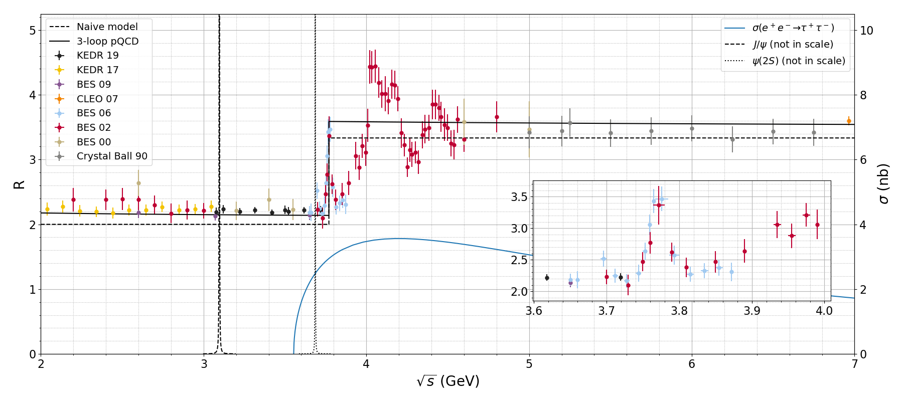

# RPlot

Python package for the `R` ratio plotting in the energy range between 2 and 7 Gev. The `R` parameter is the ratio of the total cross section of the `e+e- -> hadrons` process to the cross section of the `e+e- -> mu+ mu-` process.

Raw data is taken from [PDG](https://pdg.lbl.gov/2019/hadronic-xsections/hadron.html) and stored in [JSON](data) files.

Script [`rplot.py`](rplot.py) reads the data and produces a plot like this:

